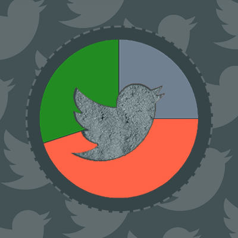
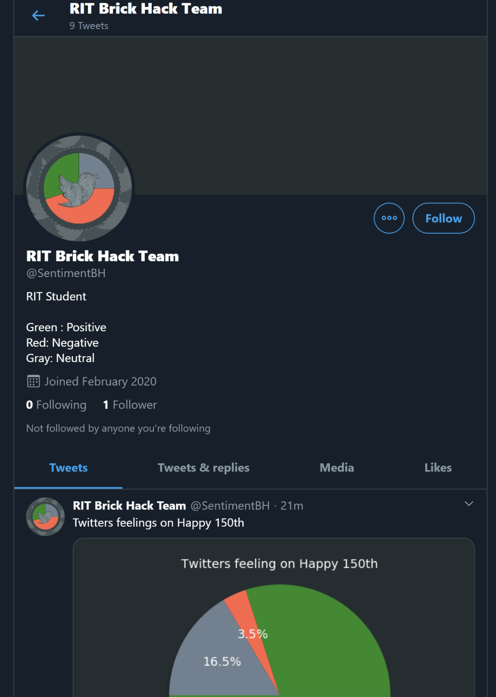

<!-- PROJECT LOGO -->
 

  

  <h3 align="center">#SentimentBH</h3>

  

    ## Twitter Bot - @SentimentBH
     
     
     
  

<!-- TABLE OF CONTENTS -->
## Table of Contents

* [About the Project](#about-the-project)
  * [Built With](#built-with)
* [Contact](#contact)
* [Acknowledgements](#acknowledgements)

<!-- ABOUT THE PROJECT -->
## About The Project

  

Creates visualizations of the sentiment surrounding currently trending topics on Twitter.
Visualizations include pie charts showing the percentage of users who have a positive, negative, or neutral view of the
topic at hand.

### Built With

* [Azure](https://azure.microsoft.com/en-us/)
* [Tweepy](https://www.tweepy.org/)
* [Matplotlib](https://matplotlib.org/)

<!-- CONTACT -->
## Contact

Twitter Bot - [@SentimentBH](https://twitter.com/SentimentBH)

Project Link: [https://github.com/emd5310/SentimentBH](https://github.com/emd5310/SentimentBH)

<!-- ACKNOWLEDGEMENTS -->
## Acknowledgements

* [BrickHack 6](https://brickhack.io)
